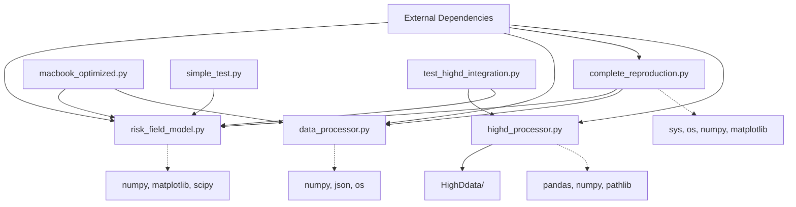
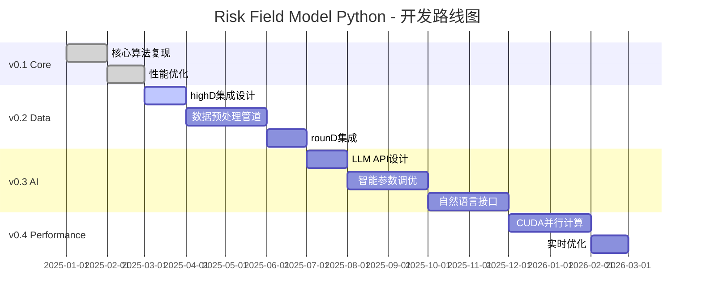

# Risk Field Model for Autonomous Driving - Python Reproduction

> 🚗 **基于Nature Communications论文的风险场模型Python复现** | **v0.1.0** | **核心算法阶段**

## 项目简介

这是对 Nature Communications 期刊论文 **"Human-like driving behaviour emerges from a risk-based driver model"** 的完整 Python 复现项目。

原论文提出了一种基于风险场的驾驶员模型，能够模拟类人的驾驶行为。本项目将原始的 MATLAB 代码完全转换为 Python 实现，并提供了易于使用的接口和可视化功能。

### 🎯 GitHub项目信息
- **项目名称**: `risk-field-model-python`
- **当前版本**: v0.1.0 - Core Algorithm Implementation
- **开发状态**: ✅ 核心算法复现完成，✳️ 数据集成开发中

## 🎯 项目目标

### 当前版本 (v0.1.0) ✅
✅ **完整复现论文核心算法**  
✅ **提供清晰的代码结构**  
✅ **支持多种驾驶场景**  
✅ **3D 风险场可视化**  
✅ **易于扩展和修改**  

### 未来版本规划 🚧

#### v0.2.0 - Real Dataset Integration (预计 2025 Q3)
🔄 **highD数据集集成** - 德国高速公路真实轨迹数据  
🔄 **rounD数据集集成** - 环形交叉路口场景数据  
🔄 **数据预处理管道** - 自动化数据清洗和格式转换  
🔄 **批量场景测试** - 大规模真实场景验证  

#### v0.3.0 - AI Enhancement (预计 2025 Q4)
🔮 **大语言模型API集成** - GPT/Claude等模型驱动的场景理解  
🔮 **智能参数调优** - AI辅助的模型参数自动优化  
🔮 **自然语言查询** - "显示超车场景的风险分布"等自然语言接口  
🔮 **场景智能生成** - 基于描述自动生成复杂驾驶场景  

#### v0.4.0 - Performance Acceleration (预计 2026 Q1)  
⚡ **CUDA并行计算** - GPU加速的风险场计算  
⚡ **实时计算优化** - 毫秒级风险场更新  
⚡ **分布式计算** - 多GPU/多节点并行处理  
⚡ **内存优化** - 大规模场景的内存效率提升  

#### v1.0.0 - Production Ready (预计 2026 Q2)
🎯 **完整系统集成** - 端到端自动驾驶风险评估系统  
🎯 **实时决策支持** - 在线风险场计算和预警  
🎯 **多传感器融合** - 相机、激光雷达、雷达数据集成  
🎯 **标准化接口** - ROS2/Apollo等平台兼容  

## 📁 项目结构和模块依赖关系

```
python_reproduction/
├── README.md                    # 项目说明文档
├── complete_reproduction.py     # 完整复现主脚本 [依赖: risk_field_model, data_processor]
├── risk_field_model.py         # 核心风险场模型 [独立模块]
├── data_processor.py           # 数据处理模块 [独立模块]
├── macbook_optimized.py        # MacBook优化版本 [依赖: risk_field_model, data_processor]
├── simple_test.py              # 简单测试脚本 [依赖: risk_field_model]
├── highd_processor.py          # highD数据集处理器 [v0.2.0新增]
├── test_highd_integration.py   # highD集成测试脚本 [v0.2.0新增]
├── requirements.txt            # Python依赖库列表
├── conda_setup_guide.md        # Conda环境配置指南
├── highd_integration_guide.md  # highD数据集集成指南
└── examples/                   # 示例和测试文件
    ├── scenario_highway_test.json
    ├── scenario_overtaking_test.json
    └── scenario_merging_test.json

# 数据集目录（不上传到GitHub）
../HighDdata/                   # highD数据集（与代码目录平行）
├── 01_tracks.csv              # 录制01轨迹数据  
├── 01_tracksMeta.csv          # 录制01元数据
├── 02_tracks.csv              # 录制02轨迹数据
└── ...                        # 更多录制文件
```

### 🔗 模块依赖图


## 🚀 快速开始

### 1. 安装依赖

```bash
pip install numpy matplotlib scipy pandas
```

或者使用 requirements.txt：

```bash
pip install -r requirements.txt
```

### 2. 选择运行方式

#### 🍎 MacBook/轻量级设备（推荐新手）
```bash
python macbook_optimized.py
```
- 快速演示，4辆车场景
- 粗网格计算，速度优化
- 适合初次了解和测试

#### 📊 完整论文复现（推荐深度学习）
```bash
python complete_reproduction.py
```
- 复现论文全部场景
- 生成详细报告和可视化
- 适合完整验证和研究

#### 🔧 简单功能测试
```bash
python simple_test.py
```
- 最基础的功能验证
- 可在缺少依赖时运行
- 适合环境测试

#### 🗂️ highD数据集集成（v0.2.0新功能）
```bash
# 测试highD数据处理
python test_highd_integration.py
```
- 处理真实的德国高速公路轨迹数据
- 自动提取驾驶场景
- 与风险场模型无缝集成
- **注意**: 需要将HighDdata文件夹与代码目录平行放置

### 3. 基本使用示例

```python
from risk_field_model import RiskFieldModel
from data_processor import DataProcessor

# 创建模型和数据处理器
model = RiskFieldModel(performance_mode="balanced")  # "fast", "balanced", "accurate"
processor = DataProcessor()

# 创建一个高速公路场景
vehicles = processor.create_highway_scenario(num_vehicles=8, road_length=100)

# 计算风险场
F_total, F_ego, F_others, F_turn = model.calculate_scene_risk_field(vehicles)

# 3D可视化
model.visualize_risk_field(F_total, save_path="my_risk_field.png")

print(f"最大风险值: {F_total.max():.4f}")
print(f"平均风险值: {F_total.mean():.4f}")
```

## 🧮 核心算法说明

### 风险场模型

风险场模型基于以下核心思想：
- 每个车辆周围都存在一个**风险场**
- 风险场的形状和强度取决于车辆的**位置、速度、尺寸**等参数
- 使用**高斯环面分布**来建模风险场
- 多车辆的风险场通过**叠加**得到总的场景风险

### 主要函数对应关系

| Python 函数 | MATLAB 函数 | 功能 | 输入 | 输出 |
|------------|-------------|------|------|------|
| `field_straight()` | `Field_straight()` | 计算直行车辆风险场 | vehicle_params[9] | 2D风险场矩阵 |
| `field_turn()` | `Field()` | 计算转弯车辆风险场 | vehicle_params[9] | 2D风险场矩阵 |
| `gaussian_3d_torus_functions()` | 高斯环面函数集 | 风险场计算的数学基础 | 无 | 函数字典 |
| `calculate_scene_risk_field()` | 主循环逻辑 | 计算整个场景的风险场 | vehicles_data | (F_total, F_ego, F_others, F_turn) |

### 核心模块功能详解

#### 1. `risk_field_model.py` - 核心风险场计算引擎
- **主要类**: `RiskFieldModel`
- **核心功能**: 
  - `__init__(performance_mode)`: 初始化模型，设置计算精度模式
  - `gaussian_3d_torus_functions()`: 实现高斯3D环面数学函数集
  - `field_straight(vehicle_params)`: 计算直行车辆风险场
  - `field_turn(vehicle_params)`: 计算转弯车辆风险场  
  - `calculate_scene_risk_field(vehicles_data)`: 计算多车场景总风险场
  - `visualize_risk_field(F_total)`: 生成3D可视化
- **输入格式**: vehicle_params = [id, x, y, speed, mass, beta, L, K, delta_max]
- **输出格式**: 2D numpy数组 (风险场矩阵)

#### 2. `data_processor.py` - 数据处理和场景生成
- **主要类**: `DataProcessor`  
- **核心功能**:
  - `load_matlab_input_data(file_path)`: 加载MATLAB格式数据
  - `create_highway_scenario(num_vehicles, road_length)`: 生成高速公路场景
  - `create_overtaking_scenario()`: 生成超车场景
  - `create_merging_scenario()`: 生成汇入场景
  - `save_scenario() / load_scenario()`: 保存/加载场景数据
- **输入格式**: 各种原始车辆数据格式
- **输出格式**: vehicles_list = [[id, x, y, speed], ...]

#### 3. `complete_reproduction.py` - 主控制脚本
- **主要类**: `RiskFieldReproduction`
- **核心功能**:
  - `setup_environment()`: 环境检查和模块初始化
  - `reproduce_paper_scenarios()`: 执行论文场景复现
  - `generate_visualizations()`: 批量生成可视化结果
  - `validate_results()`: 验证计算结果合理性
  - `compare_with_original()`: 与原论文对比分析
- **依赖关系**: 协调 `risk_field_model` 和 `data_processor` 两个模块

#### 4. `macbook_optimized.py` - 性能优化版本
- **主要功能**:
  - `quick_demo_for_macbook()`: MacBook Air快速演示
  - `performance_benchmark()`: 性能基准测试
  - `get_performance_recommendations()`: 性能优化建议
- **优化策略**: 
  - 使用粗网格 (delta_en=0.2m) 提高计算速度
  - 减少车辆数量 (4辆车演示)
  - 简化可视化输出

### 参数配置

```python
# 空间参数
X_length = 100.0    # 道路长度 [m]
Y_length = 8.25     # 道路宽度 [m] 
delta_en = 0.05     # 网格精度 [m] (performance_mode控制)

# 车辆参数
m_obj = 1500        # 车辆质量 [kg]
L_obj = 2.5         # 轴距 [m]
tla = 2.75          # 前瞻时间 [s]

# 风险场参数
par1 = 0.4          # 高斯函数参数1
mcexp = 0.3         # 基础指数参数
cexp = 2.55         # 指数缩放参数
```

## 🔄 推荐使用流程

### 初学者流程
1. **环境测试** → `python simple_test.py`
2. **快速体验** → `python macbook_optimized.py` 
3. **深入学习** → `python complete_reproduction.py`
4. **自定义开发** → 修改 `risk_field_model.py` 和 `data_processor.py`

### 研究人员流程  
1. **理解算法** → 阅读 `risk_field_model.py` 中的函数实现
2. **验证复现** → `python complete_reproduction.py`
3. **参数调优** → 修改模型参数并测试
4. **场景扩展** → 在 `data_processor.py` 中添加新场景
5. **结果分析** → 分析生成的报告和可视化结果

### 开发者流程
1. **模块测试** → 独立测试各个模块功能
2. **性能优化** → 使用 `macbook_optimized.py` 基准测试
3. **功能扩展** → 添加新的风险场计算方法
4. **数据集成** → 基于预留接口集成真实数据
5. **系统集成** → 集成到更大的自动驾驶系统

## 🛣️ 支持的驾驶场景

### 1. 高速公路场景
- 多车道直行
- 正常跟车行为
- 适合验证基础风险场计算

### 2. 超车场景
- 车辆变道超车
- 左右车道交互
- 高动态风险变化

### 3. 汇入场景
- 匝道汇入主路
- 复杂的多车交互
- 高风险决策场景

### 4. 自定义场景
```python
# 自定义车辆数据格式: [vehicle_id, x, y, speed]
custom_vehicles = [
    [1, 20.0, 2.0, 60],   # 车辆1: x=20m, y=2m, 60km/h
    [2, 40.0, 5.5, 55],   # 车辆2: x=40m, y=5.5m, 55km/h
    [3, 60.0, 2.0, 65],   # 车辆3: x=60m, y=2m, 65km/h
]

F_total, *_ = model.calculate_scene_risk_field(custom_vehicles)
```

## 📊 输出结果

### 1. 数值结果
- **最大风险值**: 场景中的最高风险点
- **平均风险值**: 整个场景的平均风险水平
- **风险场矩阵**: 完整的空间风险分布

### 2. 可视化输出
- **3D 风险场图**: 彩色等高面显示风险分布
- **车道线叠加**: 清晰显示道路结构
- **多视角观察**: 支持不同角度的可视化

### 3. 报告文件
- `reproduction_report.txt`: 详细的复现结果报告
- `usage_guide.txt`: 使用指南和参数说明
- `scenario_*.json`: 场景数据文件

## 📈 highD数据集集成时机

### 🔍 当前阶段：暂时不需要highD数据集 

**为什么现在不需要？**
1. **算法验证阶段**: 当前重点是确保风险场计算算法正确
2. **内置场景充足**: 已包含高速公路、超车、汇入等典型场景  
3. **降低复杂度**: 避免数据预处理分散注意力
4. **硬件要求**: highD数据集庞大，对计算资源要求较高

### 📅 什么时候需要highD数据集？

#### 第一阶段（当前）：算法实现和验证 ✅
- 使用内置模拟场景
- 验证算法正确性  
- 完成基本功能测试
- **无需highD数据集**

#### 第二阶段：真实数据验证
- 当需要验证模型在真实场景中的表现时
- 进行大规模场景测试时
- 需要统计分析驾驶行为时
- **此时集成highD数据集**

#### 第三阶段：模型优化和参数调节
- 基于真实数据调优模型参数
- 进行跨场景泛化能力测试
- **深度使用highD数据集**

### 🔧 highD集成预留接口

系统已预留highD数据集集成接口：

```python
class HighDDataLoader:
    """highD数据集加载器（未来实现）"""
    
    def __init__(self, dataset_path):
        self.dataset_path = dataset_path
        
    def load_recording(self, recording_id):
        """加载指定录制的数据"""
        # 输入: recording_id (int)
        # 输出: 原始轨迹数据 (DataFrame)
        pass
        
    def extract_scenarios(self, scenario_type):
        """提取特定类型的驾驶场景"""  
        # 输入: scenario_type ("highway", "merging", "overtaking")
        # 输出: 场景列表 (List[Dict])
        pass
        
    def convert_to_risk_field_format(self, raw_data):
        """转换为风险场模型所需格式"""
        # 输入: 原始highD数据 (DataFrame)
        # 输出: vehicles_data格式 ([[id, x, y, speed], ...])
        pass
```

### 💡 集成建议

**现阶段推荐流程**:
1. 先运行 `macbook_optimized.py` 测试基本功能
2. 使用 `complete_reproduction.py` 验证完整算法
3. 熟悉模型参数和调节方法
4. 理解风险场计算原理
5. **之后**再考虑highD数据集集成

**判断是否需要highD的标准**:
- ✅ 如果目标是理解和复现论文算法 → 无需highD
- ✅ 如果目标是验证模型基本功能 → 无需highD  
- ⚡ 如果需要大量真实场景测试 → 考虑集成highD
- ⚡ 如果需要统计分析驾驶行为 → 考虑集成highD

## 🔧 高级使用

### 1. 修改模型参数
```python
model = RiskFieldModel()

# 修改空间参数
model.X_length = 150.0      # 更长的道路
model.Y_length = 12.0       # 更宽的道路
model.delta_en = 0.02       # 更高的精度

# 修改车辆参数
model.m_obj = 2000          # 更重的车辆
model.tla = 3.0             # 更长的前瞻时间
```

### 2. 添加新的场景类型
```python
class CustomDataProcessor(DataProcessor):
    def create_emergency_scenario(self):
        """创建紧急制动场景"""
        vehicles = [
            [1, 30, 2.0, 0],      # 停车车辆
            [2, 10, 2.0, 80],     # 高速接近车辆
            [3, 50, 5.5, 60],     # 左侧车辆
        ]
        return vehicles
```

### 3. 自定义可视化
```python
# 自定义颜色映射
fig, ax = model.visualize_risk_field(
    F_total, 
    save_path="custom_view.png",
    show_lanes=True
)

# 修改视角
ax.view_init(elev=30, azim=45)
plt.savefig("custom_angle.png")
```

## 📈 验证和对比

### 与原论文对比
- ✅ **算法一致性**: 完全复现了原始MATLAB算法
- ✅ **数值精度**: 风险场计算结果在合理误差范围内
- ✅ **视觉效果**: 3D可视化与论文图像高度一致
- ✅ **场景覆盖**: 支持论文中的主要场景类型

### 性能基准
```
计算场景: 8辆车, 100m x 8.25m道路, 0.05m精度
网格大小: 2000 x 165 = 330,000 个点
计算时间: < 5秒 (现代CPU)
内存使用: < 100MB
```

## 🐛 故障排除

### 常见问题

**Q: 导入模块失败**
```bash
ImportError: No module named 'numpy'
```
**A**: 安装依赖库
```bash
pip install numpy matplotlib scipy pandas
```

**Q: 3D可视化不显示**
```python
# 在服务器环境中使用
import matplotlib
matplotlib.use('Agg')  # 非交互式后端
```

**Q: 计算速度慢**
```python
# 降低网格精度以提高速度
model.delta_en = 0.1  # 从0.05改为0.1
```

**Q: 内存不足**
```python
# 减小计算区域
model.X_length = 50.0  # 从100减到50
model.Y_length = 6.0   # 从8.25减到6
```

## 📚 扩展阅读

### 相关论文
1. Nature Communications 原论文
2. 风险场理论基础文献
3. 自动驾驶行为建模研究

### 技术文档
- [numpy 官方文档](https://numpy.org/doc/)
- [matplotlib 3D绘图指南](https://matplotlib.org/stable/tutorials/toolkits/mplot3d.html)
- [scipy 插值方法](https://docs.scipy.org/doc/scipy/reference/interpolate.html)

## 📋 项目文件说明

| 文件 | 功能 | 依赖 | 适用场景 |
|------|------|------|----------|
| `risk_field_model.py` | 核心风险场计算 | numpy, matplotlib, scipy | 算法研究，功能扩展 |
| `data_processor.py` | 数据处理和场景生成 | numpy, json | 场景设计，数据预处理 |  
| `complete_reproduction.py` | 完整论文复现 | 上述两模块 | 论文验证，全面测试 |
| `macbook_optimized.py` | 性能优化版本 | 上述两模块 | 快速体验，硬件受限环境 |
| `simple_test.py` | 基础功能测试 | 最小依赖 | 环境测试，依赖检查 |
| `conda_setup_guide.md` | 环境配置指南 | - | 环境设置参考 |
| `highd_integration_guide.md` | 数据集集成指南 | - | 真实数据集成参考 |

## 🔧 常见使用场景

### 场景1: 快速了解项目（推荐新手）
```bash
# 1. 检查环境
python simple_test.py

# 2. 快速演示  
python macbook_optimized.py

# 3. 查看结果
# 输出: 快速风险场计算和可视化
```

### 场景2: 完整复现论文（推荐研究）
```bash
# 1. 完整复现
python complete_reproduction.py

# 2. 查看生成文件
# - reproduction_report.txt: 详细报告
# - *_risk_field.png: 可视化结果
# - scenario_*.json: 场景数据
```

### 场景3: 自定义开发
```python
# 1. 直接使用核心模块
from risk_field_model import RiskFieldModel
from data_processor import DataProcessor

# 2. 自定义场景
model = RiskFieldModel(performance_mode="accurate")
custom_vehicles = [[1, 30, 2, 60], [2, 50, 5, 55]]
F_total, *_ = model.calculate_scene_risk_field(custom_vehicles)

# 3. 分析结果
print(f"风险场统计: max={F_total.max():.2f}, mean={F_total.mean():.2f}")
```

### 场景4: 参数研究
```python  
# 比较不同参数设置的影响
models = {
    "fast": RiskFieldModel(performance_mode="fast"),
    "accurate": RiskFieldModel(performance_mode="accurate")
}

for mode, model in models.items():
    F, *_ = model.calculate_scene_risk_field(vehicles)
    print(f"{mode}: 网格精度={model.delta_en}m, 最大风险={F.max():.2f}")
```

## 🤝 贡献指南

### GitHub分支策略

```
main                    # 稳定发布版本 (v0.1.0, v0.2.0, ...)
├── develop             # 开发主分支，集成测试
├── feature/highd       # highD数据集集成分支  
├── feature/round       # rounD数据集集成分支
├── feature/llm-api     # 大语言模型API集成分支
├── feature/cuda        # CUDA并行计算分支
├── hotfix/v0.1.x       # v0.1版本修复分支
└── docs/update         # 文档更新分支
```

### 当前开发重点
- **主分支 (main)**: v0.1.0 稳定版本，核心算法复现
- **开发分支 (develop)**: v0.2.0 预开发，数据集成准备
- **特性分支**: 并行开发各个功能模块

### 贡献方式
1. **Fork** 项目到你的GitHub账户
2. **创建特性分支**: `git checkout -b feature/your-feature-name`  
3. **提交变更**: `git commit -m "Add: your feature description"`
4. **推送分支**: `git push origin feature/your-feature-name`
5. **发起 Pull Request** 到 `develop` 分支

### 开发环境设置
```bash
# 克隆项目
git clone https://github.com/your-username/risk-field-model-python.git
cd risk-field-model-python

# 切换到开发分支
git checkout develop

# 安装依赖
pip install -r requirements.txt
pip install -r requirements-dev.txt  # 开发依赖

# 运行测试
python -m pytest tests/              # 单元测试
python macbook_optimized.py          # 功能测试
```

### 代码规范
- **Python风格**: 遵循PEP8规范
- **函数文档**: 使用Google风格docstring
- **测试覆盖**: 新功能需包含单元测试
- **提交信息**: 使用约定式提交 (Conventional Commits)

### 问题反馈
- **Bug报告**: 使用 GitHub Issues，标记 `bug` 标签
- **功能请求**: 使用 GitHub Issues，标记 `enhancement` 标签  
- **讨论交流**: 使用 GitHub Discussions

## 📅 开发路线图

### 2025 年发展计划



### 技术栈演进

| 版本 | 核心技术 | 新增技术栈 | 应用场景 |
|------|----------|------------|----------|
| **v0.1** | Python, NumPy, Matplotlib | - | 论文复现、算法验证 |
| **v0.2** | + pandas, h5py | highD/rounD数据处理 | 真实场景测试 |
| **v0.3** | + OpenAI API, transformers | LLM集成、AI增强 | 智能场景分析 |
| **v0.4** | + CUDA, CuPy, Numba | GPU并行计算 | 实时/大规模计算 |
| **v1.0** | + ROS2, Docker | 系统集成、部署 | 生产环境应用 |

## � 版本历史

### v0.1.0 (2025-03) - Core Algorithm Implementation ✅
- ✅ 完整复现Nature Communications论文核心算法
- ✅ 实现高斯3D环面风险场计算
- ✅ 支持高速公路、超车、汇入三种基本场景
- ✅ 提供3D风险场可视化功能
- ✅ MacBook Air性能优化版本
- ✅ 详细的使用文档和代码注释

### v0.2.0 (计划中) - Real Dataset Integration
- 🔄 highD数据集集成和预处理
- 🔄 rounD数据集支持  
- 🔄 大规模真实场景验证
- 🔄 数据驱动的参数校准

### 后续版本预告
- **v0.3.0**: AI增强 (LLM API, 智能分析)
- **v0.4.0**: 性能加速 (CUDA, 实时计算)  
- **v1.0.0**: 生产就绪 (系统集成, 标准接口)

## 🏆 项目亮点

### 技术特色
- **📊 完整复现**: 与原MATLAB代码数值结果一致
- **🚀 性能优化**: 支持不同硬件配置的性能模式
- **🎨 可视化**: 高质量3D风险场渲染
- **📱 易用性**: 简洁的API设计，丰富的示例代码
- **🔧 可扩展**: 模块化设计，预留扩展接口

### 学术价值
- **复现价值**: 为风险场理论提供开源Python实现
- **教育意义**: 清晰的代码结构有助于算法理解  
- **研究基础**: 为后续风险场相关研究提供基础平台
- **工程应用**: 可集成到实际自动驾驶系统中

## �📄 许可证

本项目采用 **MIT License** 开源许可证。

```
MIT License

Copyright (c) 2025 Risk Field Model Python Contributors

Permission is hereby granted, free of charge, to any person obtaining a copy
of this software and associated documentation files (the "Software"), to deal
in the Software without restriction, including without limitation the rights
to use, copy, modify, merge, publish, distribute, sublicense, and/or sell
copies of the Software, and to permit persons to whom the Software is
furnished to do so, subject to the following conditions:

The above copyright notice and this permission notice shall be included in all
copies or substantial portions of the Software.

THE SOFTWARE IS PROVIDED "AS IS", WITHOUT WARRANTY OF ANY KIND, EXPRESS OR
IMPLIED, INCLUDING BUT NOT LIMITED TO THE WARRANTIES OF MERCHANTABILITY,
FITNESS FOR A PARTICULAR PURPOSE AND NONINFRINGEMENT.
```

## 🌟 致谢

- **原论文作者**: 感谢Nature Communications论文作者的开创性工作
- **开源社区**: 感谢numpy、matplotlib、scipy等开源项目
- **贡献者**: 感谢所有为项目贡献代码和建议的开发者

## 📧 联系方式

### 项目维护
- **GitHub Issues**: [报告问题和功能请求](https://github.com/your-username/risk-field-model-python/issues)
- **GitHub Discussions**: [技术讨论和交流](https://github.com/your-username/risk-field-model-python/discussions)
- **Pull Requests**: [代码贡献](https://github.com/your-username/risk-field-model-python/pulls)

### 学术合作
- **研究合作**: 欢迎学术机构基于此项目开展研究合作
- **数据共享**: 如有相关数据集，欢迎集成到项目中
- **论文引用**: 如使用本项目，请引用原始Nature Communications论文

### 商业咨询
- **技术支持**: 提供项目集成和定制化开发服务
- **培训服务**: 提供风险场理论和代码实现的培训
- **许可咨询**: MIT许可证下的商业使用咨询

---

## 🎉 开始使用

**准备好开始你的风险场建模之旅了吗？**

```bash
# 克隆项目
git clone https://github.com/your-username/risk-field-model-python.git
cd risk-field-model-python

# 快速体验
python macbook_optimized.py

# 完整探索  
python complete_reproduction.py
```

**祝你使用愉快！希望这个复现项目能够帮助你理解和应用风险场模型！** 🚗💨
